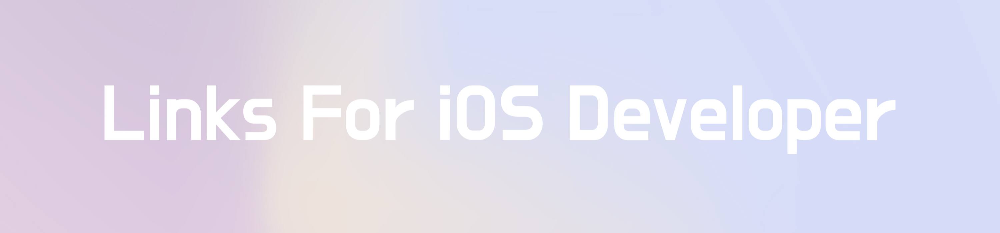

## About
iOS 개발자들이 알아두면 유용한 사이트와 링크를 모아서 각 카테고리별로 정리한 링크 목록입니다. 특히 iOS 개발을 처음 시작하는 사람이 정보 부족으로 힘들어하지 않고 조금이라도 쉽게 접근하는데 도움이 됐으면 합니다.

링크가 깨지거나 다른 문제가 있을 경우 알려주세요. 그리고 추천할 만한 링크는 같이 공유 해주시면 좋겠습니다.

## Content

* [Basic](#basic)
* [Apple Programming Guide](#apple-programming-guide)
* [Community](#community)
* [Conference](#conference)
* [Blog](#blog)
* [Mailing List](#mailing-list)
* [Device Specification](#device-specification)
* [Icon](#icon)
* [Color](#color)
* [Font](#font)
* [Sound](#sound)
* [Image](#image)
* [Git](#git)
* [GitHub](#github)
* [Dependency Manager](#dependency-manager)
* [Collections](#collections)
* [Theme](#theme)
* [Patterns](#patterns)
* [Markdown](#markdown)
* [Design](#design)
* [Online Playground](#online-playground)
* [Prototyping Tool](#prototyping-tool)
* [Learning](#learning)
* [Platform / Open API](#platforms--open-api)
* [Networking](#networking)
* [JSON Parsing Helper](#json-parsing-helper)
* [Mobile DataBase](#mobile-database)
* [Automation](#automation)
* [Analytics](#analytics)
* [AD](#ad)
* [CI](#ci)
* [Converter](#converter)
* [Tool](#tool)
* [Algorithm](#algorithm)
* [Regular Expression](#regular-expression)
* [Recruit](#recruit)
* [Report](#report)
* [etc](#etc)

---

 

## Basic

#### Swift

* [Swift Language](https://swift.org)
* [Swift Language Guide](https://docs.swift.org/swift-book/LanguageGuide/TheBasics.html)
* [Swift Language Guide 번역본](https://jusung.gitbook.io/the-swift-language-guide/)
* [Swift GitHub](https://github.com/apple/swift)
* [Swift Evolution](https://github.com/apple/swift-evolution) - Changes and user-visible enhancements to the Swift Programming Language
* [SwiftDoc](https://swiftdoc.org) - Auto-generated documentation for Swift

#### SwiftUI & Combine

* [SwiftUI Tutorials](https://developer.apple.com/tutorials/swiftui/tutorials)
* [SwiftUI UsageGuide](https://jinxiansen.github.io/SwiftUI/)
* [About SwiftUI](https://github.com/Juanpe/About-SwiftUI)
* [SwiftUI Cheat Sheet](https://github.com/SimpleBoilerplates/SwiftUI-Cheat-Sheet)
* [RxSwift to Combine Cheatsheet](https://github.com/freak4pc/rxswift-to-combine-cheatsheet)

#### Apple

* [Developer Site](https://developer.apple.com/develop/)
* [Developer Documentation](https://developer.apple.com/documentation/)
* [Documentation Archive](https://developer.apple.com/library/archive/navigation/)

#### Xcode

* [Xcode Download](https://developer.apple.com/download)
* [Xcode Help](http://help.apple.com/xcode/)

#### WWDC

* [WWDC Videos](https://developer.apple.com/videos/)
* [ASCIIwwdc](http://asciiwwdc.com)  -  각 WWDC Session에 대한 자막 모음

#### App Store Connect

* [App Store Connect](https://appstoreconnect.apple.com)
* [App Store Connect Help](https://help.apple.com/app-store-connect/)
* [App Store Connect Overview](https://itunespartner.apple.com/en/apps/news)
* [App Store Connect Review Guidelines](https://developer.apple.com/app-store/review/guidelines/)
* [Common App Rejections](https://developer.apple.com/app-store/review/rejections/)

#### Design Guideline

* [Human Interface Guideline](https://developer.apple.com/ios/human-interface-guidelines/)
* [iOS Design Guidelines](https://ivomynttinen.com/blog/ios-design-guidelines)

#### Coding Style Guideline

* [API Design Guidelines](https://swift.org/documentation/api-design-guidelines)
* [Raywenderich Swift Style Guide](https://github.com/raywenderlich/swift-style-guide)
* [Google Swift Style Guide](https://google.github.io/swift)
* [SwiftLint](https://github.com/realm/SwiftLint) -  스위프트 코딩 컨벤션을 강제하여 올바른 스타일을 따를 수 있도록 돕는 라이브러리

 

## Apple Programming Guide

*애플 프로그래밍 가이드 문서*

* [App Programming Guide for iOS](https://goo.gl/mu57YK)
* [ViewController Programming Guide for iOS](https://goo.gl/pLv5rF) 
* [View Programming Guide for iOS](https://goo.gl/cc9bx1) 
* [Auto Layout Guide](https://goo.gl/jPnmcX) 
* [Table View Programming Guide for iOS](https://goo.gl/2JUPAu)
* [Debugging with Xcode](https://goo.gl/4XZNxq) 
* [Code Signing Guide](https://goo.gl/1KZL5q) 
* [Simulator User Guide](https://goo.gl/p5hp2q)
* [File System Programming Guide](https://goo.gl/Bxm1H6)
* [Text Programming Guide for iOS](https://goo.gl/E1ndzH)
* [Bundle Programming Guide](https://goo.gl/CjMYXh)
* [In-App Purchase Programming Guide](https://goo.gl/64c7LP)
* [Information Property List Key Reference](https://goo.gl/6Pt2te)
* [Local and Remote Notification Programming Guide](https://goo.gl/RQRmHT)

 

## Community

*iOS개발자들이 모이는 커뮤니티 모음*

* [카카오톡 iOS 오픈 채팅방](https://open.kakao.com/o/gyLape)
* [Slack - Swift (Korea)](https://swiftkorea.slack.com)
* [Slack - Swift (Global)](https://swift-lang.slack.com)
* [Swift Korea Facebook Group](https://www.facebook.com/groups/swiftkor)
* [아이폰 데브](http://iphonedev.co.kr)
* [맥부기 (카페)](https://cafe.naver.com/mcbugi)
* [맥 쓰는 사람들 (카페)](https://cafe.naver.com/inmacbook)

 

## Conference

*국내외 컨퍼런스 링크 모음*

* [LetSwift](http://letswift.kr) - 현재 국내 최대 규모 iOS 컨퍼런스 (1년 단위)
* [let us: Go!](https://github.com/iOSDevKor?tab=repositories) - iOS 오픈 채팅방이 주축이 되어 현재 가장 활발하게 운영 중인 컨퍼런스 (분기 단위)
* [Swift Korea Meetup](https://swiftkorea.github.io/meetup) - Swift Korea Facebook Group을 기반으로 운영되는 컨퍼런스 (비정기)

**Overseas**
* [CocoaConferences](https://github.com/Lascorbe/CocoaConferences) - iOS 컨퍼런스 목록
* [AltConf](http://altconf.com) - WWDC 에 참석 못 한 사람들을 위해 WWDC 가 열리는 San Jose 시내에서 동일한 일정으로 열리는 컨퍼런스. 티켓 무료
* [try! Swift](https://www.tryswift.co) - 미국(뉴욕), 일본(도쿄), 인도(방갈로) 등 여러 나라에서 개최되고 있는 컨퍼런스 (3일간 진행)
* [RWDevCon](https://www.rwdevcon.com) - Ray Wenderich가 운영하는 DevCon. 단순히 발표를 듣기보다 함께 따라치면서 배우는 튜토리얼 컨퍼런스 (3일간 진행)
* [360iDev](http://360idev.com) - 미국 덴버에서 열리는 대규모 컨퍼런스, RawyWenderich 와 파트너 관계 (4일간 진행)
* [Pragma Conference](http://www.pragmaconference.com) - 이탈리안 애플 개발자 컨퍼런스(3일간 진행)
* [Swift Conf](https://swiftconf.com) - 유럽에서 열리는 국제 컨퍼런스로 2012년부터 시작되어 가장 오래 열린 컨퍼런스 중 하나 (2일간 진행)

 

## Blog

*iOS 개발 지식을 채워줄 블로그 모음*

* [Ray Wenderich](https://www.raywenderlich.com)
* [APPCODA](https://www.appcoda.com)
* [NSHipster](http://nshipster.com)
* [Envato Tuts+](https://code.tutsplus.com/categories/ios-sdk)
* [Big Nerd Ranch](https://www.bignerdranch.com/blog/categories/ios)
* [Flawless App Stories](https://medium.com/flawless-app-stories)

 

## Mailing List

*iOS / Swift 에 대한 주간 이슈/정보 메일링 사이트*

* [Swift Public Mailing List](https://lists.swift.org/mailman/listinfo)
* [iOS Goodies](http://ios-goodies.com)
* [iOS Dev Weekly](https://iosdevweekly.com)
* [Swiftweekly](http://swiftweekly.com) 
* [This week in Swift](https://swiftnews.curated.co)
* [AppCoda Weekly](http://digest.appcoda.com)
* [indie iOS Weekly](https://indieiosfocus.com)

 

## Device Specification

*iPhone, iPad 등 각 기기에 대한 명세서 링크* 

* [Support Matrix](http://iossupportmatrix.com)
* [iOS Device Types](https://support.hockeyapp.net/kb/client-integration-ios-mac-os-x-tvos/ios-device-types)
* [iPhone Specs](https://support.apple.com/ko_KR/specs/iphone)
* [iOS Device Compatibility Reference](https://developer.apple.com/library/archive/documentation/DeviceInformation/Reference/iOSDeviceCompatibility/Displays/Displays.html)
* [iOS Device Specs Grid](http://blakespot.com/ios_device_specifications_grid.html)
* [List of iOS Devices](https://en.wikipedia.org/wiki/List_of_iOS_devices)
* [iPhone Resolutions](https://goo.gl/vwbzQY) 
* [iPhone 6 Screens Demystified](https://goo.gl/nNXDWL)
* [iPhone X Screen Demystified](https://goo.gl/rxLKtX)

 

## Icon

*앱 개발에 필요한 각종 아이콘 다운로드 사이트*

* [icons8](https://icons8.com)
* [thenounproject](https://thenounproject.com) 
* [iconfinder](https://www.iconfinder.com) 
* [flaticon](https://www.flaticon.com) 
* [material icons](https://material.io/icons/)

**Paid**
* [PixelLove](https://www.pixellove.com)
* [Streamline](https://www.streamlineicons.com)

 

## Color

*앱 컬러 스킴 참고 사이트*

* [iOS Visual Design Color](https://developer.apple.com/design/human-interface-guidelines/ios/visual-design/color) 
* [Material Design Color](https://material.io/design/color/)
* [material Design Palette](https://www.materialpalette.com) 
* [Adobe Color](https://color.adobe.com/ko/create)
* [Coolors](https://coolors.co) 
* [colllor](http://colllor.com)
* [paletton](http://paletton.com)
* [Flat UI Colors](https://flatuicolors.com)
* [Design Seeds](https://www.design-seeds.com/by-color/)

**Gradients**
* [Gradients Collection](https://uigradients.com/)
* [WebGradients](https://webgradients.com)

 

## Font

*시스템 기본 폰트가 식상한 사람들을 위한 무료 폰트 모음*

* [구글](https://github.com/google/fonts)
* [네이버](https://hangeul.naver.com/2017/nanum)
* [우아한 형제들](http://font.woowahan.com)
* [야놀자](http://yanolja.in/ko/yafont/)
* [티몬](https://brunch.co.kr/@creative/32)
* [미생체](http://webtoon.daum.net/event/misaengfont) 
* [서울 서체](http://www.seoul.go.kr/v2012/seoul/symbol/font.html) 
* [가비아](https://company.gabia.com/font) 
* [무료 폰트 모음](http://hellchosun.net/52) 
* [WhatTheFont](https://www.myfonts.com/WhatTheFont/) - 이미지에 적용된 폰트가 무엇인지 궁금할 때
* [wordmark](https://wordmark.it) - 컴퓨터에 설치된 폰트 모두를 한 번에 비교하고 싶을 때

**Tool**
* [FontBase](https://fontba.se) - 폰트 관리 도구

 

## Sound

*앱 효과음 / 배경음악에 필요한 사운드 제공 사이트 모음*

**Sound Effect** 
* [Youtube SoundEffects](https://www.youtube.com/audiolibrary/soundeffects)
* [Facebook SoundKit](https://facebook.design/soundkit)
* [Google Sound Library](https://developers.google.com/actions/tools/sound-library) 
* [Free sound](https://freesound.org)
* [SoundBible](http://soundbible.com)
* [Find Sounds](http://www.findsounds.com) 
* [Emoji Sounds](https://emojisounds.appsounds.pro) 
* [Noise for Fun](https://www.noiseforfun.com) 
* [Free SFX](https://www.freesfx.co.uk)

**Music**
* [Youtube Music](https://www.youtube.com/audiolibrary/music)
* [Bensound](https://www.bensound.com/royalty-free-music)
* [Music for Video](https://music-for-video.com/subscribe-to-our-newsletter-and-get-free-music-tracks)
* [Incompetech](https://incompetech.com)

 

## Image

*앱 개발에 필요한 이미지 사이트 모음*

**Placeholder Image** 
* [LoremFlickr](https://loremflickr.com) 
* [Lorem Picsum](https://picsum.photos) 
* [dummyImage](https://dummyimage.com)

**High Resolution Photo** 
* [unsplash](https://unsplash.com)
* [pixabay](https://pixabay.com)
* [pexels](https://www.pexels.com)
* [lifeofpix](https://www.lifeofpix.com)
* [foodiesfeed](https://www.foodiesfeed.com)

**App Icon**
* [Make App Icon](https://makeappicon.com) - 앱 아이콘 셋 생성
* [App Icon Generator](https://appicon.co) - 앱 아이콘 및 이미지셋 생성

**Animations**
* [LottieFiles](https://lottiefiles.com) - Lottie 애니메이션 리소스 모음

 

## Git

*Git 사용을 위한 기본 링크 모음*

* [Git 공식 홈페이지](https://git-scm.com)
* [Pro Git 2nd Edition](https://git-scm.com/book/ko/v2)
* [git ignore.io](https://www.gitignore.io)

**Repository**
* [Github](https://github.com)
* [Bitbucket](https://bitbucket.org)

**Tutorial / Guide**
* [Resources to learn Git](https://try.github.io)
* [Git-Turorial](https://backlog.com/git-tutorial/kr)
* [Learn Git](https://www.atlassian.com/git/tutorials/what-is-version-control)
* [git - 간편 안내서](http://rogerdudler.github.io/git-guide/index.ko.html)
* [Git Cheatsheet](https://github.com/arslanbilal/git-cheat-sheet)

**Git Flow**
* [git-flow](https://github.com/nvie/gitflow) - 원활한 브랜치 운영 관리를 위해 사용하는 Git 확장 명령어 모음
* [git-flow cheatsheet](https://danielkummer.github.io/git-flow-cheatsheet/index.ko_KR.html)

**Tool**
* [Sourcetree](https://www.sourcetreeapp.com) - GUI Tool
* [GitKraken](https://www.gitkraken.com) - GUI Tool
* [diff-so-fancy](https://github.com/so-fancy/diff-so-fancy) - 터미널에서 git diff 명령의 결과를 보기 쉽도록 변환해주는 스크립트

 

## GitHub

*GitHub 관련 사이트*

* [GitHut](https://githut.info) - GitHub 에서 사용되는 각 프로그래밍 언어별 활성화 지표 시각화
* [Git Awards](http://git-awards.com) - 도시별, 나라별, 유저별 GitHub 랭킹 검색
* [Rankedin](http://rankedin.kr) - 한국 개발자들을 대상으로 한 GitHub 랭킹 순위
* [GitHub Trending](https://github.com/trending) - 오늘의 가장 트렌디한 GitHub 오픈소스 소개 

 

## Dependency Manager

*라이브러리 의존성 관리 매니저*

* [CocoaPods](https://cocoapods.org)
* [Carthage](https://github.com/Carthage/Carthage)
* [Swift Package Manager](https://github.com/apple/swift-package-manager)

 

## Collections

*유용한 컬렉션들에 대한 컬렉션*

**iOS Library**
* [Awesome-iOS](https://github.com/vsouza/awesome-ios)
* [Awesome-Swift](https://github.com/matteocrippa/awesome-swift)
* [Awesome-Swift](https://github.com/Wolg/awesome-swift)
* [Awesome iOS with stars count](https://awesome-repos.ecp.plus/ios.html#categories)
* [Awesome-iOS](http://awesome-ios.readthedocs.io/en/latest/#awesome-ios)

**UI**
* [Awesome-iOS-UI](https://github.com/cjwirth/awesome-ios-ui)
* [Awesome iOS Chart](https://github.com/ameizi/awesome-ios-chart)
* [Fantastic-iOS-Animation](https://github.com/onmyway133/fantastic-ios-animation)
* [Swift UI Libraries](https://goo.gl/WdvyLk)
* [Cocoa Controls](https://www.cocoacontrols.com)

**App**
* [Open Source iOS Apps](https://github.com/dkhamsing/open-source-ios-apps)

**Others**
* [Awesome ARKit](https://github.com/olucurious/Awesome-ARKit)
* [Awesome CoreML Models](https://github.com/likedan/Awesome-CoreML-Models)
* [Swift Tips](https://github.com/JohnSundell/SwiftTips) - Swift 개발에 유용한 팁 모음
* [Marketing for Engineers](https://github.com/LisaDziuba/Marketing-for-Engineers) - 엔지니어를 위한 마케팅 조언

 

## Theme

*Xcode Theme*

* [Code Themes](http://www.codethemes.net) - Theme 목록
* [Xcode Themes](https://github.com/hdoria/xcode-themes) - Theme 목록
* [Tomorrow Theme](https://github.com/chriskempson/tomorrow-theme) - Tomorrow Theme
* [Dracula](https://draculatheme.com/xcode) - Dracula Theme

 

## Patterns

*아키텍처 패턴 / 디자인 패턴*

**Architecture Pattern**
* [Fantastic iOS Architecture](https://github.com/onmyway133/fantastic-ios-architecture)

**Design Pattern**
* [Design Patterns in Swift](https://github.com/ochococo/Design-Patterns-In-Swift)

 

## Markdown

*Markdown 작성을 위한 추천 링크*

* [GitHub Mastering Markdown](https://guides.github.com/features/mastering-markdown) - GitHub 마크다운 매뉴얼
* [DILLINGER](https://dillinger.io) - 온라인 마크다운 에디터
* [grip](https://github.com/joeyespo/grip) - 오프라인 깃허브 마크다운 프리뷰

**Tool**
* [Typora](https://typora.io) - 추천 마크다운 에디터

 

## Design

*개발자에게 부족한 디자인 능력을 메꿔줄 링크 모음*

**Tool**
* [Sketch](https://www.sketchapp.com)
* [Zeplin](https://zeplin.io)

**Design Reference Site**
* [Design notes](https://www.designnotes.co)
* [dribbble](https://dribbble.com/search?q=ios)
* [Pinterest](https://www.pinterest.co.kr/search/pins/?q=ios)
* [Uplabs](https://www.uplabs.com/ios)
* [pttrns](https://pttrns.com/iphone-patterns)
* [Behance](https://www.behance.net/search?search=ios)
* [UI8](https://ui8.net)
* [Mobbin](https://mobbin.design)

**Material Design**
* [Material Design](https://material.io)
* [Material Design Components](https://material.io/components/ios)

**Facebook Design**
* [Facebook Design](http://facebook.design)

**Resource**
* [Apple Design Resources](https://developer.apple.com/design/resources/#ios-apps)
* [Sketch App Resources](https://www.sketchappsources.com/tag/ios.html)
* [Sketch REPO](https://sketchrepo.com)
* [30+ great UI Kits](https://medium.com/flawless-app-stories/30-great-ui-kits-for-ios-engineers-41b2732896b9)

**3D Assets**
* [Sketchfab](https://sketchfab.com)
* [3D Warehouse](https://3dwarehouse.sketchup.com)
* [Turbosquid](https://www.turbosquid.com)
* [cgtrader](https://www.cgtrader.com)

**3D Textures**
* [3D Textures](https://3dtextures.me)
* [Motionworks](https://motionworks.net/shop/material-pack-element-3d)
* [V-Ray Materials](http://www.vraymaterials.co.uk)

 

## Online Playground

*간단한 Swift 코드를 실행시켜 볼 수 있는 온라인 Playground*

* [Online Swift Playground](http://online.swiftplayground.run)
* [Swift Online](https://paiza.io/en/languages/swift)

 

## Prototyping Tool

*빠른 프로토타입 개발 및 기획자/디자이너와의 협업을 위한 툴*

* [Invision](https://www.invisionapp.com)
* [Marvel](https://marvelapp.com)
* [Framer](https://framer.com)
* [Balsamiq](https://balsamiq.com) 
* [Flinto](https://www.flinto.com) 
* [Origami](https://origami.design)

 

## Learning

*iOS/Swift 개발을 위한 학습 사이트*

**무료 동영상 사이트**
* [T 아카데미](https://tacademy.sktechx.com)
* [edwith](https://www.edwith.org)
* [한글링](http://hangling.org/#/home)
* [Realm 아카데미](https://academy.realm.io/kr/section/apple/)
* [Programmers](https://programmers.co.kr/learn/courses/4)
* [생활코딩](https://www.opentutorials.org)
* [Khan Academy](https://ko.khanacademy.org/computing)
* [KOCW](http://www.kocw.net)
* [K-MOOC](http://www.kmooc.kr)

**강의별 유/무료 동영상 사이트**
* [인프런](https://www.inflearn.com)
* [edX](https://www.edx.org)
* [Coursera](https://www.coursera.org)
* [UDACITY](https://www.udacity.com)
* [Udemy](https://www.udemy.com)

**Presentation Slide**
* [SlideShare](https://www.slideshare.net)
* [Speaker Deck](https://speakerdeck.com)

 

## Platforms / Open API

*각 플랫폼별 라이브러리 및 OpenAPI 모음*

* [Naver Developers](https://developers.naver.com)
* [Kakao Developers](https://developers.kakao.com)
* [T Developers](https://developers.sktelecom.com)
* [공공데이터 포털](https://www.data.go.kr)
* [관광공사 Tour API](http://api.visitkorea.or.kr)
* [국가통계포털 공유서비스](http://kosis.kr/openapi/index/index.jsp)
* [서울열린데이터광장](https://data.seoul.go.kr/)
* [서울시 공공앱 API](https://mplatform.seoul.go.kr/api/main.do)

**Overseas**
* [Firebase](https://firebase.google.com)
* [Facebook for Developers](https://developers.facebook.com)
* [GitHub Developer](https://developer.github.com)
* [YAHOO Developer Network](https://developer.yahoo.com)
* [Slack API](https://api.slack.com)
* [Twitter Developers](https://developer.twitter.com)
* [AWS Mobile](https://aws.amazon.com/ko/mobile/)
* [Instagram API](https://www.instagram.com/developer/)
* [API Directory](https://www.programmableweb.com/apis/directory)

 

## Networking

*네트워킹에 유용한 링크 모음*

**Tool**
* [Postman](https://www.getpostman.com) - API 테스트 지원 도구
* [Insomnia](https://insomnia.rest) - API 테스트 지원 도구
* [GraphQL Playground](https://github.com/prisma/graphql-playground) - GraphQL IDE

**GraphQL**
* [GraphQL](https://graphql.org) - Facebook 공식 페이지
* [GraphQL](https://www.graphql.com) - Apollo 팀에서 운영하는 GraphQL 홈페이지
* [Apollo Flatform](https://www.apollographql.com) - Apollo Platform 홈페이지
* [How to GraphQL](https://www.howtographql.com) - GraphQL Tutorial

 

## JSON Parsing Helper

*JSON 파싱을 쉽게 하기 위한 보조 도구 모음*

* [quicktype](https://app.quicktype.io) - JSON 형식에 맞게 Codable 코드를 자동 생성해주는 웹서비스
* [quicktype-xcode](https://github.com/quicktype/quicktype-xcode) - JSON 형식에 맞게 Codable 코드를 자동 생성해주는 Xcode Extension
* [SwiftyJSON](https://github.com/SwiftyJSON/SwiftyJSON) - JSON 파싱을 쉽게 할 수 있도록 도와주는 오픈소스 라이브러리

 

## Mobile DataBase

*모바일 데이터 관리를 위한 DBMS*

* [FMDB](https://github.com/ccgus/fmdb) - SQLite Wrapper
* [SQLite](https://github.com/stephencelis/SQLite.swift) - SQLite Wrapper
* [Realm](https://realm.io) - (뤰/렘 o, 렐름 x) 신흥 모바일 DBMS
* [Realm Studio](https://docs.realm.io/platform/realm-studio) - Realm Database, Realm Platform 관리 도구 (기존 Realm Browser 에서 대체) 

 

## Automation

*자동화 도구*

* [Fastlane](https://fastlane.tools) - 사이닝, 테스트, 빌드, 배포 등 앱 프로그래밍 외적인 작업 자동화 도구

 

## Analytics

*고객 및 앱 데이터 분석을 위한 라이브러리*

* [Google Analytics](https://www.google.com/analytics)
* [Facebook Analytics](https://analytics.facebook.com)
* [Crashlytics](https://try.crashlytics.com)
* [Yahoo Flurry](https://developer.yahoo.com/analytics/)

**Paid**
* [Adjust](https://www.adjust.com)
* [Mixpanel](https://mixpanel.com)
* [Amazon Pinpoint](https://aws.amazon.com/ko/pinpoint)
* [유저해빗](https://www.userhabit.io/ko)

 

## AD

*앱 내 광고를 위한 라이브러리*

* [Google AdMob](https://developers.google.com/admob/ios/quick-start)
* [Facebook Audience-Network](https://developers.facebook.com/docs/audience-network/ios)

 

## CI

*지속적 통합(Continous Integration)을 위한 주요 서비스 모음. 주로 fastlane 과 연동하여 CI/CD 구현*

* [CD(지속적 배포) 가이드](https://ko.atlassian.com/continuous-delivery) - CI / CD 에 대한 개념 가이드
* [Xcode Server](https://developer.apple.com/videos/play/wwdc2017/403) - Xcode 9 부터 CI 를 지원하기 위한 제공되기 시작한 내장 기능
* [Travis CI](https://travis-ci.org) - 가장 대표적인 CI 서비스 중 하나로 호스트형 서비스. 오픈소스에 적용 시 무료.
* [Circle CI](https://circleci.com) - Travis 와 같은 호스트형 서비스. 매달 빌드 소요시간 1,500분까지 무료
* [Jenkins](https://jenkins.io) - Java로 개발된 오픈소스 툴로써 대표적인 설치형 서비스. 무료이나 직접 빌드 서버 설정 필요

 

## Converter

*Swift와 다른 프로그래밍 언어간 변환 지원*

* [Swiftify](https://objectivec2swift.com) - Objective-C 코드를 Swift 으로 변환
* [SwiftKotlin](https://github.com/angelolloqui/SwiftKotlin) - Swift 코드를 Kotlin 으로 변환

 

## Tool

*개발에 유용한 도구 모음*

* [Alfred](https://www.alfredapp.com) - 맥 사용자 생산성 향상에 필요한 필수 앱
* [Pusher](https://github.com/noodlewerk/NWPusher) - APNS 테스트 도구
* [BuildTimeAnalyzer for Xcode](https://github.com/RobertGummesson/BuildTimeAnalyzer-for-Xcode) - Xcode 빌드타임 분석
* [Visual Studio Code](https://code.visualstudio.com) - 텍스트 에디터

**Terminal**
* [iTerm](https://www.iterm2.com) - 기본 터미널 기능을 강화한 macOS용 터미널 프로그램
* [Oh My Zsh](https://ohmyz.sh) - Z Shell 설정 관리 프레임워크
* [Powerlevel9k](https://github.com/bhilburn/powerlevel9k/wiki/Show-Off-Your-Config) - Powerline Fonts를 사용하는 Z Shell용 Theme

**Paid**
* [BetterTouchTool](https://folivora.ai) - 유저 입력 이벤트 커스터마이징 기능을 제공하는 맥용 앱
* [AppCode](https://www.jetbrains.com/objc/) - JetBrains 에서 개발한 iOS/macOS 개발용 IDE
* [REVEAL](https://revealapp.com) - 런타임 뷰 디버깅
* [Flawless](https://flawlessapp.io) - 시뮬레이터 플러그인을 통한 이미지 비교 / UI 이슈 체크

 

## Algorithm

*알고리즘 학습 사이트 모음*

* [백준 온라인 저지](https://www.acmicpc.net)
* [코딩도장](http://codingdojang.com)
* [알고스팟](https://algospot.com)
* [프로젝트 오일러](http://euler.synap.co.kr)
* [프로그래머스](https://programmers.co.kr/learn/challenges)
* [한국정보올림피아드](http://www.digitalculture.or.kr/koi/selectOlymPiadDissentList.do)

**Overseas**
* [Swift Algorithm Club](https://github.com/raywenderlich/swift-algorithm-club)
* [LeetCode](https://leetcode.com/problemset)
* [Codility](https://app.codility.com/programmers/lessons)
* [Hacker Rank](https://www.hackerrank.com/dashboard)
* [Exercism](https://exercism.io/my/tracks)
* [Project Euler](https://projecteuler.net)
* [Codechef](https://www.codechef.com)

 

## Regular Expression

*정규표현식 학습 사이트*

* [RegExr](https://regexr.com) - 정규표현식 학습 및 테스트 사이트
* [RegexOne](https://regexone.com) - 레슨 형식으로 정규표현식 학습 가능
* [REGEXPER](https://regexper.com) - 입력한 정규표현식을 다이어그램 형태로 표현
* [RegExLib](http://regexlib.com/DisplayPatterns.aspx?cattabindex=0&categoryId=1) - 이메일, 주소 등 자주 사용되는 정규표현식에 대해 검색 가능
* [DebuggexBeta](https://www.debuggex.com/cheatsheet/regex/python) - 정규표현식 치트 시트

 

## Recruit

*구인구직 사이트 및 참고 자료 모음*

**Site**
* [Wanted](https://www.wanted.co.kr/wdlist/518/678)
* [Jobplanet](https://www.jobplanet.co.kr/job_postings/search?query=iOS)
* [RocketPunch](https://www.rocketpunch.com/jobs?job=sw-developer&specialty=iOS)
* [OKKY](https://okky.kr/articles/jobs?query=ios&sort=id)
* [Kredit Job](https://kreditjob.com)

**Info**
* [주니어 채용 스케쥴 정보](https://github.com/jojoldu/junior-recruit-scheduler)
* [Awesome Interview Questions](https://github.com/MaximAbramchuck/awesome-interview-questions)
* [영문 이력서 작성 팁](https://sujinlee.me/entry-level-en-resume)

 

## Report

*개발자, 프로그래밍 언어와 관련된 설문조사 & 통계 보고서*

**Survey**
* [Stackoverflow - 2019 Developer Survey Results](https://insights.stackoverflow.com/survey/2019)
* [Hackerrank - 2019 Developer Skills Report](https://research.hackerrank.com/developer-skills/2019)
* [Programmers - 2019 Programmers Report](https://programmers.co.kr/pages/dev-survey-2019)

**Ranking**
* [PYPL PopularitY of Programming Language](http://pypl.github.io/PYPL.html)
* [RedMonk Programming Language Rankings: 2019](https://redmonk.com/sogrady/2019/03/20/language-rankings-1-19/)
* [Worst Programming Languages to Learn in 2019](https://www.codementor.io/blog/worst-languages-2019-6mvbfg3w9x)

 

## etc

*차후 적절한 카테고리로 묶여 이동될 수 있는 링크*

* [iOS Developer Roadmap](https://github.com/BohdanOrlov/iOS-Developer-Roadmap) - iOS 개발자를 위한 로드맵
* [Writing Exercises](http://writingexercises.co.uk/index.php) - 각종 랜덤 데이터 (단어, 문장, 이미지 등 ) 추출
* [Random User Me](https://randomuser.me) - 랜덤 유저 생성 API 제공
* [App Review Times](http://appreviewtimes.com) - 최근 앱 스토어 평균 리뷰 시간 제공
* [Why The Failure, Auto Layout](https://www.wtfautolayout.com) - 오토레이아웃 에러 로그 관련 사항을 시각화
* [App Privacy Policy Generator](https://app-privacy-policy-generator.firebaseapp.com) - Privacy Policy, Terms & Conditions 생성
* [swift-scripts](https://github.com/PaulTaykalo/swift-scripts) - 미사용 Swift code, file, function 탐색
* [DeallocationChecker](https://github.com/fastred/DeallocationChecker) - 메모리 릭이 발생하는 뷰컨트롤러 캐치
